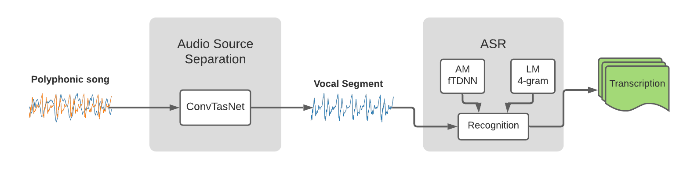

# Automatic Vocal Separation and Lyrics Transcription.

<div align="center">


</div>

--------------------------------------------------------------------------------

This repository stores the scripts submitted to MIREX 2020:Lyrics Transcription task.

The system relies on [Asteroid Pytorch-based audio source separation toolkit](https://github.com/mpariente/asteroid) and
for the vocal enhancement pre-process stage, and on [Kaldi ASR toolkit](http://kaldi-asr.org/) for the transcription stage. 

## Content
- [Installation](#installation)


## Installation
First, you need to download and install Kaldi toolkit as:
```bash
git clone https://github.com/kaldi-asr/kaldi.git kaldi --origin upstream

cd kaldi/tools
touch python/.use_default_python
./extras/check_dependencies.sh
```
The script extras/check_dependencies.sh will tell you if you need to install some Kaldi dependencies before continue.
After you install all the dependencies, you need to run.
```bash
make

./extras/install_phonetisaurus.sh
./extras/install_miniconda.sh
```  
Now, please download SRILM from http://www.speech.sri.com/projects/srilm/download.html.  
Rename the file as:
```
e.g.:
mv srilm-1.7.3.tar.gz srilm.tar.gz
```
copy srilm.tar.gz into kaldi/tools and run 
```
./extras/install_srilm.sh
```
Now, you need to move to SRC directory and compile Kaldi.
Be sure the --cuda-dir is directed to your cuda installation.
```bash
cd ../scr
./configure --shared --cudatk-dir=/usr/local/cuda
make -j clean depend; make -j 4
```

## Obtaining 


## Cite
```
@inproceedings{Roa-Mirex2020,
  title={Automatic Vocal Enhancement and Lyrics Transcription},
  year={2020},
  booktitle={International Society for Music Information Retrieval (ISMIR)},
  author={Roa Dabike, Gerardo and Barker, Jon}
}
```